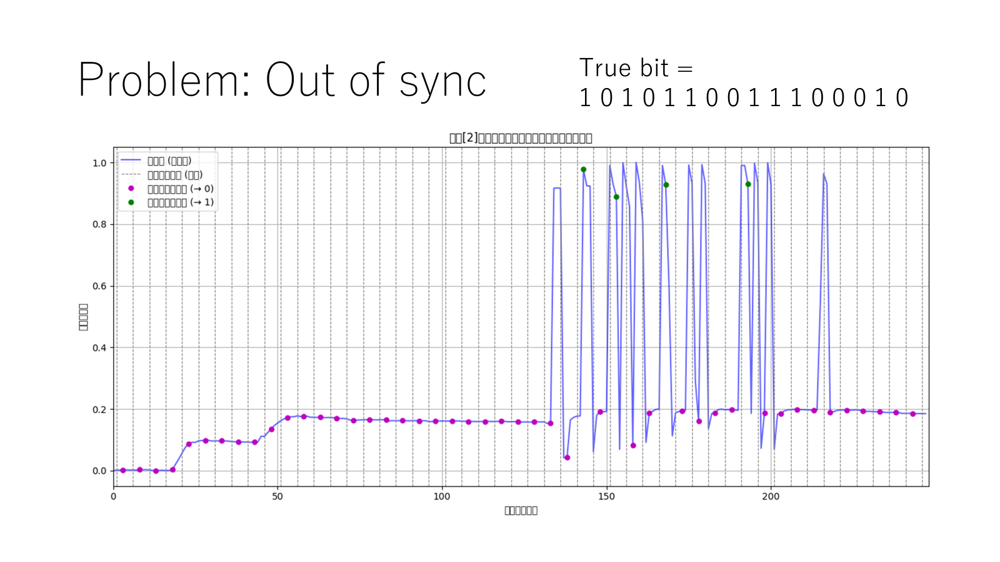

# Optical Camera Communication (OCC): Prototype System

※現在の研究テーマとは異なります

## 1. Project Overview
汎用的なWebカメラ（30fps）とLEDを用いた可視光通信システムのプロトタイプ開発プロジェクト。
本段階では、**フレーム間通信（Frame-Based Communication）** による基礎システムの構築を完了し、距離50cm〜150cmの実環境下における通信特性を検証しました。現在は、より高速な通信を実現するためのRolling Shutter方式への移行フェーズにあります。

**Technical Highlights:**
* **Modulation:** 2-PAM (Pulse Amplitude Modulation)
* **Symbol Rate:** 15 baud (approx. 66ms/symbol)
* **Result:** 特定条件下で **BER 0.00%** を達成し、原理動作を実証。

## 2. System Architecture
システムは送信機（Tx）と受信機（Rx）で構成されます。

* **Transmitter (Tx):**
    * **Device:** Arduino Uno
    * **Actuator:** Standard LED (Pin 11)
    * **Logic:** PCからシリアル通信でビット列を受け取り、タイマー制御により66ms間隔でLEDをOn/Off制御。
* **Receiver (Rx):**
    * **Device:** PC / Raspberry Pi Camera (30fps)
    * **Logic:** 取得した動画フレーム内の特定領域（ROI）の平均輝度を時系列データとして抽出。

## 3. Decoding Algorithm (復号アルゴリズム)
受信した動画データから信号を復元するため、以下の信号処理パイプラインを実装しました（`demodulator.py`）。

1.  **Signal Extraction (信号抽出):**
    * 各フレームのROI（関心領域）の平均輝度を算出し、正規化を行う。
2.  **Synchronization (同期):**
    * **Edge Detection:** 輝度信号を微分し、信号の変化点（エッジ）を検出。
    * **Rate Estimation:** 事前に定義したシンボルレート（2.0 frames/symbol周辺）で探索を行い、変化点と最も整合する位相（Phase）を特定して同期を確立。
3.  **Sampling (サンプリング):**
    * エッジ付近の遷移ノイズを避けるため、シンボルの中央タイミング（Sampling Phase）で値を判定し、0/1を復調。

## 4. Experiment Result (実験結果)
通信距離（50cm, 100cm, 150cm）において50bitのデータ送信実験を行いました。

**結果サマリ:**
* **成功例:** 各距離において、調整が成功したトライアルでは **BER 0.00%（エラーなし）** を達成。
* **課題:** 周囲環境や手動ROI設定のズレにより、BERが40%近くまで悪化するケースも確認されており、ロバスト性に課題を残した。

**BER測定結果（一部抜粋）:**
| Distance | Sent Bits | Errors | BER | Status |
| :--- | :--- | :--- | :--- | :--- |
| 50cm | 50 | 0 | **0.00%** | Success |
| 100cm | 50 | 0 | **0.00%** | Success |
| 150cm | 50 | 0 | **0.00%** | Success |

*(詳細はリポジトリ内の `report/Experiment_Result_Data.pdf` を参照)*

## 5. Implementation Note (エンジニアリングの工夫)
### 理論値と実測値のギャップ解消
開発当初、理論上の計算式に基づいて送信間隔を設定しましたが、同期ズレが多発しました。

* **課題:** Python（OpenCV）側のフレーム取得タイミングと、Arduinoのシリアル受信・実行処理の間に微小なレイテンシが存在した。
* **解決策:** * `[1シンボル当たりのフレーム数] = [送信時間] * [fps]` の関係式を見直し、パラメータチューニングを実施。
    * 最終的に送信時間を **66ms**（約2フレーム/シンボル）に設定することで、最も安定した同期が得られることを特定しました。

### AI Assistance
アルゴリズムのコアロジック（同期検波・サンプリング）の設計は自身で行い、NumPyを用いた行列演算やOpenCVの描画処理の実装において生成AIを活用し、開発効率を向上させました。

## 6. Future Work (今後の展望)
現在のFrame-Based通信は低速（約15bps）であるため、次は以下の改良を計画しています。

* **Rolling Shutter方式の実装:**
    * CMOSセンサーのライン露光遅延を利用し、1フレーム内に多数のビット情報（ストライプ）を含めることで通信速度を数kbpsオーダーまで高速化する。
* **ROI自動追尾:**
    * 現在手動で行っているLED検出を自動化し、通信の安定性を向上させる。

## 7. Author
Koki Matano
University of Aizu
